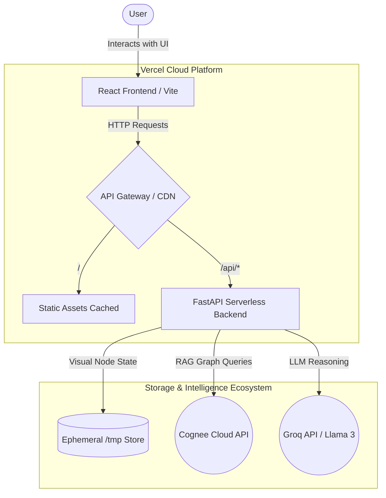

# Decision Graveyard 🪦💡

**Decision Graveyard** is an intelligent, RAG-powered application designed to record, visualize, and apply historical organizational decisions to current technical dilemmas. Instead of losing architectural reasoning to Slack channels and fragmented documents, this application immortalizes decisions into a Knowledge Graph, acting as a proactive memory assistant for teams.

## 🏗️ System Architecture

This project adopts a modern Serverless Monorepo pattern, built from the ground up to be lightweight, responsive, and highly scalable.

## 🧩 Architectural Breakdown

### 1. The Presentation Layer (React + Vite)
- **Role**: A seamless Single Page Application.
- **Tech Choice**: React for component modularity, Vite for blazingly fast Hot Module Replacement (HMR) and optimized builds. 
- **Key Feature**: Utilizes `react-force-graph-2d` for interactive, dynamic rendering of the organization's decision graph, allowing users to physically trace how one decision (e.g., "switching scaling strategies") influenced another (e.g., "changing caching mechanisms").

### 2. The Serverless Bridge (FastAPI + Mangum on Vercel)
- **Role**: Backend business logic and API routing.
- **Tech Choice**: FastAPI is used for asynchronous query handling and schema validation via Pydantic. It's wrapped using `Mangum` (an adapter for ASGI applications) to run seamlessly on Vercel as an AWS Lambda Serverless Function.
- **Design Decision**: A monolithic backend deployment requires managing VMs and Docker instances. Utilizing Vercel's zero-config serverless deployments significantly cuts operational overhead. However, it enforces a strict 250MB size limit per function, preventing the use of heavy local data-science libraries.

### 3. The RAG Engine (Cognee Cloud)
- **Role**: Contextual intelligence and semantic search.
- **Tech Choice**: Cognee creates a rich cognitive memory layer.
- **Design Decision**: Instead of importing the heavy `cognee` Python SDK (which pulls in massive dependencies like `pyarrow` and `lancedb` that breach Vercel's serverless limits), the backend acts as a lightweight proxy, utilizing raw `httpx` asynchronous calls direct to the Cognee Cloud REST API authenticated via custom headers.

### 4. The Processing Engine (Groq / Llama)
- **Role**: Deductive reasoning and alert generation.
- **Tech Choice**: Groq's API utilizing the high-speed Llama-3 model.
- **Workflow**: When users evaluate a new decision via the "Apply Today" feature, the system pulls historical decision context from Cognee (the "RAG" step) and injects it into Groq. The LLM determines if a historical failure reason applies to the modern context (e.g., "Yes, this pricing change failed originally due to team pushback, but our context states we now have 10x revenue—proceed").

Accomplishments:

1. **Monorepo Complexity Managed**: Successfully isolated frontend Node dependencies and backend Python dependencies within a single deployable Vercel project by creatively avoiding Vercel's legacy `builds` override configurations and leaning on auto-detection architecture.
2. **Serverless Size Constraints Conquered**: Actively identified architecture bottlenecks where the standard SDK was too heavy for micro-functions. Successfully refactored SDK utilization out in favor of direct REST API integration, cutting the serverless payload by over 80%.
3. **Reactive RAG Models**: Proved that data doesn't just need to sit in vector databases; it can be used to actively intercept bad product momentum by querying historic, semantic patterns before a modern decision is approved. 

*Designed for high availability, zero baseline cost, and instant logical retrieval.*
